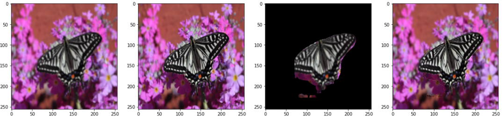
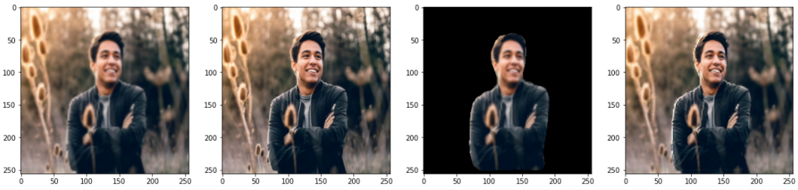

# Localized Super Resolution for Foreground Images using U-Net and MR-CNN
by
Umashankar Kumaravelan,
Nivedita M

https://arxiv.org/abs/2110.14413

> This paper has been presented at AICTE Sponsored 4th International Conference on "Recent Trends in Advanced Computing" in Collaboration between Vellore Institute of Technology, Chennai and National Cheng Kung University, Taiwan.

> The main focus of this paper was to explore the possibility of resolution increase by just computing super resolution on the foreground objects and comparing it with entire single image super resolution. The architecture is based on the combination of MR-CNN for Image Segmentation and U-Net Model for Super Resolution

## Abstract

> Images play a vital role in understanding data through visual representation. It gives a clear representation of the object in context. But if this image is not clear it might not be of much use. Thus, the topic of Image Super Resolution arose and many researchers have been working towards applying Computer Vision and Deep Learning Techniques to increase the quality of images. One of the applica-tions of Super Resolution is to increase the quality of Portrait Images. Portrait Images are images which mainly focus on capturing the essence of the main ob-ject in the frame, where the object in context is highlighted whereas the back-ground is occluded. When performing Super Resolution the model tries to in-crease the overall resolution of the image. But in portrait images the foreground resolution is more important than that of the background. In this paper, the per-formance of a Convolutional Neural Network (CNN) architecture known as U-Net for Super Resolution combined with Mask Region Based CNN (MR-CNN) for foreground super resolution is analysed. This analysis is carried out based on Localized Super Resolution i.e we pass the LR Images to a pre-trained Image Segmentation model (MR-CNN) and perform super resolution inference on the foreground or Segmented Images and compute the Structural Similarity Index (SSIM) and Peak Signal-to-Noise Ratio (PSNR) metrics for comparisons.

## Software implementation

> The technical implementation was done using Tensorflow and Keras for the U-Net Model and for the MR-CNN model we leveraged the pretrained MR-CNN Model from the mrcnn library by matterport.

## Getting the code

You can download a copy of all the files in this repository by cloning the
[git](https://git-scm.com/) repository:

    git clone https://github.com/Shanks0465/Localized_SuperResolution_Foreground.git

After cloning this project, before proceeding further, Check all dependencies and libraries required. Mainly [tensorflow](https://www.tensorflow.org/) and download and setup mrcnn library from [mrcnn](https://github.com/matterport/Mask_RCNN).

## Reproducing the results

Before running any code you must add a folder named "data" outside this folder and add the DIV2K Dataset train and valid folders.
The dataset can be downloaded from: [DIV2K Dataset](https://data.vision.ee.ethz.ch/cvl/DIV2K/).

Similarily add a "models" folder inside the project folder for saving model checkpoint files.

You can then run the train.py file or if you have saved the data in another folder replace the path for the folders.
For example: 

> "../../data/DIV2K_train_HR/DIV2K_train_HR/*.png" ------> "PATH_TO_DATA_FOLDER/DIV2K_train_HR/DIV2K_train_HR/*.png"

The model can be evaluated and results can be viewed using the LocalizedResolution_Inference.ipynb file.

To do this, you must first start the notebook server by going into the
repository top level and running:

    jupyter notebook

This will start the server and open your default web browser to the Jupyter
interface.

The notebook is divided into cells (some have text while other have code).
Each cell can be executed using `Shift + Enter`.
Executing text cells does nothing and executing code cells runs the code
and produces it's output.
To execute the whole notebook, run all cells in order.

## License

All source code is made available under a MIT license. You can freely
use and modify the code, without warranty, so long as you provide attribution
to the authors. See `LICENSE.md` for the full license text.

The manuscript text is not open source. The authors reserve the rights to the
article content, which is currently submitted for publication in the
Springer - "Lecture Notes in Electrical Engineering" - Scopus Indexed.